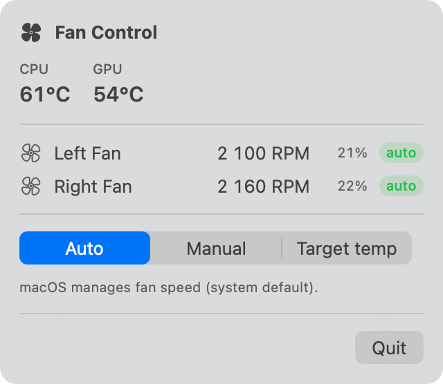
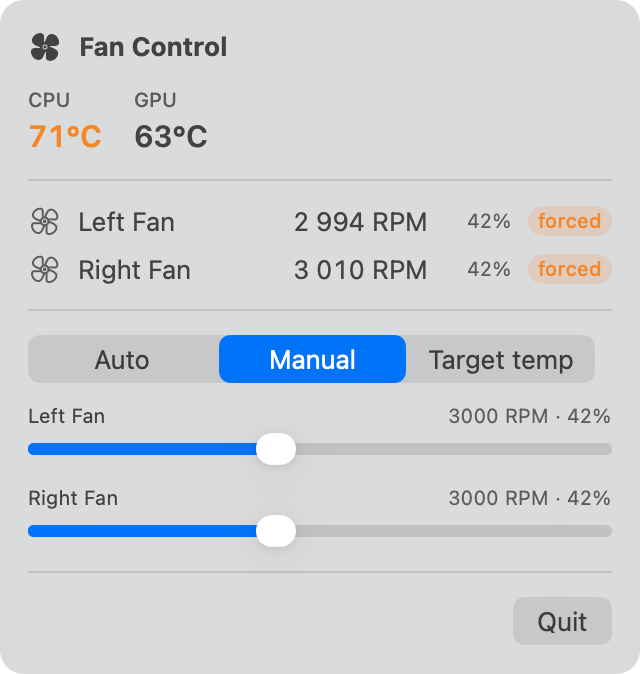
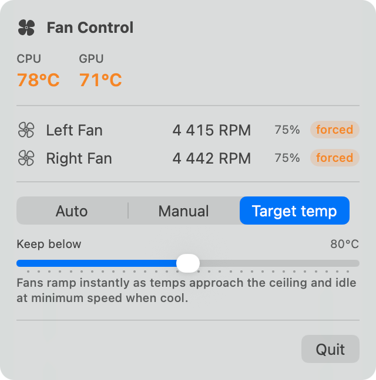

# mac-fan-control

A free Macs-Fan-Control-style fan controller for Apple Silicon (and Intel) Macs,
with the three modes you actually want:

- **Auto** — hand control back to macOS (the system default behavior).
- **Manual** — pin each fan to a fixed RPM with per-fan sliders.
- **Target temp** — pick a temperature ceiling; fans ramp smoothly between their
  min and max to keep the machine below it, and idle again once it cools off.

## Screenshots

| Auto | Manual | Target temp |
|:---:|:---:|:---:|
|  |  |  |
| macOS keeps control | Pin each fan to a fixed RPM | Hold a temperature ceiling |

Readings shown are illustrative.

## Components

| Component | What it is |
|---|---|
| `FanControl.app` | SwiftUI menu bar app: live temps + RPM, mode picker, sliders |
| `fanctld` | Root LaunchDaemon that owns the control loop and talks to the SMC |
| `fanctl` | CLI client (`status`, `sensors`, `auto`, `manual`, `target`) |

The app and CLI talk to the daemon over a local Unix socket
(`/var/run/fanctld.sock`). Reading temperatures and fan speeds needs no
privileges; *writing* fan speeds requires root, which is why the daemon exists —
the same architecture Macs Fan Control uses for its helper.

## Requirements

macOS 14 or later, Apple Silicon or Intel. Building from source needs a Swift
5.9+ toolchain — install the Xcode Command Line Tools if you don't have one:

```sh
xcode-select --install
```

## Install

### Homebrew (easiest)

```sh
brew install jbforge/tap/mac-fan-control
sudo brew services start mac-fan-control
```

No Gatekeeper warning by this route: Homebrew fetches with `curl`, which does
not attach the download quarantine flag that makes macOS refuse to open
unsigned software. The `sudo` is unavoidable — writing fan speeds means talking
to the SMC as root.

`brew info mac-fan-control` prints where the menu bar app landed and how to link
it into `/Applications`. To remove it: `sudo brew services stop mac-fan-control`
then `brew uninstall mac-fan-control`.

### Download a release

Grab the latest zip from [Releases](https://github.com/jbforge/mac-fan-control/releases),
unpack it, and run this from that folder:

```sh
./install.sh
```

It asks for your password. That is not incidental — writing fan speeds means
talking to the SMC as root, so a small daemon (`fanctld`) is installed as a
system LaunchDaemon. The installer also puts `FanControl.app` in `/Applications`
and `fanctl` in `/usr/local/bin`. `./uninstall.sh` removes all of it.

> [!IMPORTANT]
> **These builds are not signed by an Apple developer account**, and macOS
> quarantines anything downloaded from the internet. Double-click
> `FanControl.app` in your Downloads folder and macOS will refuse to open it;
> the command-line pieces get terminated outright on launch.
>
> `install.sh` clears that quarantine flag on the files it installs, which is
> most of why it exists. Run it and you will not see the warning at all.
>
> If you already tried opening the app directly and got stuck, approve it under
> System Settings → Privacy & Security → **Open Anyway** — or build from source
> below, which never picks the flag up in the first place.

### Build from source

```sh
git clone https://github.com/jbforge/mac-fan-control.git
cd mac-fan-control
make install       # builds, installs + starts the daemon (asks for sudo),
                   # and copies FanControl.app to /Applications
open /Applications/FanControl.app
```

A bundle you built yourself never carries the download quarantine flag, so
Gatekeeper stays out of the way. It isn't notarized either. Build it yourself;
that's the point.

To have the app start at login: System Settings → General → Login Items → add
FanControl.

## CLI usage

```sh
fanctl status          # temps, fan RPM, current mode
fanctl sensors         # every temperature sensor the SMC exposes
fanctl auto            # back to macOS control
fanctl manual 4000     # all fans at 4000 RPM
fanctl manual 60%      # 60% of each fan's range
fanctl manual 3500 4200  # per-fan RPM (left, right)
fanctl target 80       # keep temps below 80°C
```

(A release install puts `fanctl` on your PATH already. After a source build,
point at `.build/release/fanctl` or copy it somewhere on your PATH yourself.)

## How the target-temp mode works

The daemon polls the SMC every 2 seconds and regulates on the hotter of the CPU
and GPU "hot averages" (the mean of the hottest quartile of each group's
sensors — robust to the odd outlier hotspot key). Fan speed maps linearly from
min RPM at `target − 8 °C` to max RPM at `target`. Ramp-up is immediate (a
temperature spike reaches max fans within one 2 s tick); ramp-down is
slew-limited so speeds decay quietly. The fans stay forced (idling at their
near-silent hardware minimum when cool) rather than being handed back to auto:
parked fans get locked by macOS (mode 3), which tolerates 100 °C+ before
spinning them up — surrendering exactly the response time this mode exists for.

## Safety

- **Failsafe:** in manual or target mode, if the control temperature reaches
  100 °C — or temperature readings become unavailable — the daemon forces all
  fans to max until things cool below 92 °C. Your settings resume afterwards.
- **Clean exit:** on daemon stop/uninstall (and on SIGTERM/SIGINT), fans are
  returned to macOS automatic control.
- **Clamped inputs:** manual RPMs are clamped to each fan's hardware min/max;
  target temps are clamped to 60–95 °C. You cannot set fans *below* the SMC's
  minimum, so "manual" can never be more dangerous than the slowest speed Apple
  allows.
- **System override (macOS 26 fan parking):** when the machine is cool, macOS
  parks the fans — even ones held under forced control — and locks the SMC fan
  keys (`F*Md` reads 3; every control write is rejected with result 130/134;
  `FOff` and `F*Mn` are never writable). While parked, *no* third-party tool
  can spin the fans. The daemon shows a "system" badge, knocks every 4 s once
  temps enter the curve band, and seizes the fans within ~5 s of the firmware
  releasing them (measured: macOS holds until its own metrics warrant airflow —
  around 80 °C hot-average under sustained load — then our controller jumps
  straight to the computed target instead of Apple's minutes-long lazy ramp).
- **Access control:** only root or admin-group users can change fan settings
  over the socket; anyone local can read status.

## Efficiency

The daemon does exactly one full sensor sweep per 2 s control tick and serves
all status requests from that snapshot, so extra clients add no SMC traffic.
The menu bar app polls every 10 s while closed (2 s while the popover is open,
with timer tolerance so the system can coalesce wakeups) and only publishes UI
updates when a displayed value actually changes — no SwiftUI re-layout churn
from jittering decimals.

## Uninstall

```sh
make uninstall     # stops daemon (fans revert to auto), removes everything
```

## Development

```sh
swift build                 # debug build
.build/debug/fanctld        # run daemon unprivileged: read-only, /tmp socket
.build/debug/fanctl status  # works without the daemon too (direct SMC reads)
make app                    # assemble build/FanControl.app
```

Logs: `/Library/Logs/fanctld.log`. Config: `/Library/Application
Support/fanctld/config.json` (persists across reboots).

## License

MIT — see [LICENSE](LICENSE).

This software writes to your Mac's SMC. It clamps every input to the hardware
limits the SMC reports and has a 100 °C failsafe, but it comes with no warranty
of any kind. Use it at your own risk.
